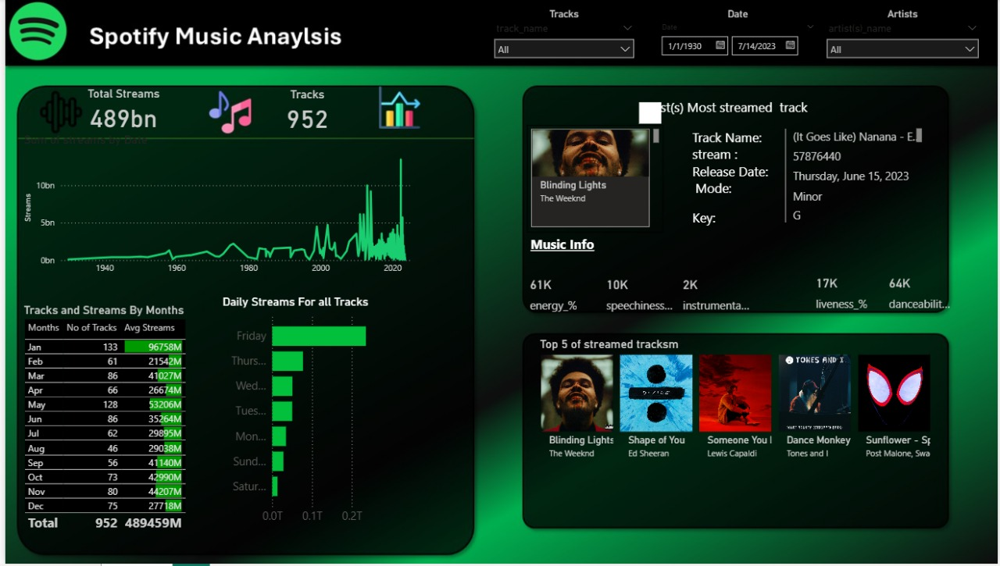

# 🎵 Spotify Dashboard - Power BI Project

## 📌 Overview
This project is an **interactive Power BI dashboard** built to analyze Spotify music data.  
The dashboard provides insights into streaming patterns, top artists, most played tracks, and trends across different time ranges.

## 🖼️ Dashboard Preview


## 📊 Features
- 🎶 **Top Artists & Songs** – View the most streamed artists and tracks.  
- ⏳ **Trends Over Time** – Analyze listening patterns by day, month, or year.  
- 🌍 **Geographical Insights** – Explore where streams are coming from.  
- 📈 **KPIs** – Total plays, unique artists, and popularity index.  
- 🔎 **Filters & Slicers** – Interact with the data for deeper exploration.  

## 🛠️ Tools & Technologies
- **Power BI Desktop** for data modeling & visualization  
- **Spotify Dataset** (CSV/Excel/SQL) as data source  
- **DAX** for calculated measures  

## 🚀 How to Use
1. Clone this repository:
   ```bash
   git clone https://github.com/username/spotify-dashboard.git
